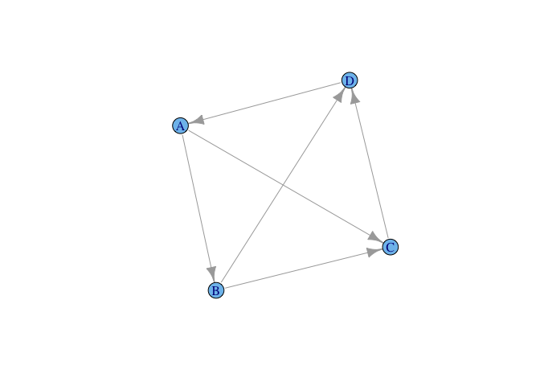
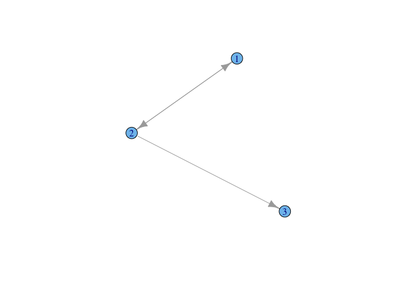
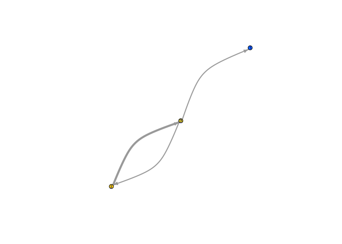

# Tracking network analysis
Bart Aelterman (bart.aelterman@inbo.be)  

This document demonstrates how to construct a graph from fish tracking data.

Content:

- [Load required libraries](#load-required-libraries)
- [Introduction to igraph](#introduction-to-igraph)
- [Construct a graph from tracking data](#construct-a-graph-from-tracking-data)
  - [Raw tracking data](#raw-tracking-data)
  - [Interval data](#interval-data)
- [Create a movement matrix](#create-a-movement-matrix)

## Load required libraries

- [igraph](http://igraph.org/r/): igraph is a very extensive package for working with graphs.
- [plyr](http://plyr.had.co.nz/): Tools for Splitting, Applying and Combining Data.


```r
source("receiver_network.R")
```

```
## 
## Attaching package: 'lubridate'
## 
## The following object is masked from 'package:plyr':
## 
##     here
## 
## The following object is masked from 'package:igraph':
## 
##     %--%
```

## Introduction to igraph

Every graph consists of vertices (nodes) and edges (arrows that connect the nodes). Both vertices and edges can have additional attributes which can be useful for analysis or plotting. Igraph allows you to quickly create a graph by providing it a dataframe containing only edges. Vertices are extracted from that dataframe. The first column of the edge is expected to contain the names of the staring vertex of the edges while the second column should contain the name of the end vertex. A basic plot can then be created with the `plot` function.

Here is a quick example:


```r
edges <- data.frame(col1=c("A", "A", "B", "B", "C", "D"),
                    col2=c("B", "C", "C", "D", "D", "A"))
print(edges)
```

```
##   col1 col2
## 1    A    B
## 2    A    C
## 3    B    C
## 4    B    D
## 5    C    D
## 6    D    A
```

```r
g <- graph.data.frame(edges)
plot(g)
```

 

You can inspect the graph's vertices and edges using the `V(g)` and `E(g)` functions respectively:


```r
print(E(g))
```

```
## Edge sequence:
##           
## [1] A -> B
## [2] A -> C
## [3] B -> C
## [4] B -> D
## [5] C -> D
## [6] D -> A
```

```r
print(V(g))
```

```
## Vertex sequence:
## [1] "A" "B" "C" "D"
```

Additional columns in the edges dataframe will be added as attributes to the edges. If you want to add attributes to the vertices, you have to pass in a dataframe containing the vertices rather than letting igraph fetch these from the edges dataframe.

A final example to illustrate this:


```r
edges <- data.frame(col1=c("A", "A", "B", "B", "C", "D"),
                    col2=c("B", "C", "C", "D", "D", "A"),
                    counts=c(1, 1, 4, 2, 2, 5))
vertices <- data.frame(col1=c("A", "B", "C", "D"),
                       weight=c(10, 4, 9, 2))
g <- graph.data.frame(edges, vertices=vertices)

# Now use the extra columns in the plotting function
plot(g, edge.width=E(g)$counts * 2, vertex.size=V(g)$weight * 3)
```

 

## Construct a graph from tracking data

### Raw tracking data

The function `detections2graph` in `receiver_network.R` will construct a graph based on raw tracking data. Each vertex represents a station (receiver) and each edge represents the movement of the tracked animal between two stations. The frequency of each edge will be added as an additional attribute. A dataframe with receiver metadata can be given to create a custom layout for the graph. The `plot.migration.detections` function can be used to create a plot from the graph.

Here's an example:


```r
detections <- data.frame(
  transmitter=c(1, 1, 1, 1, 1),
  stationname=c(1,2,1,2,3),
  timestamp=c("2014-01-02 01:00:00", "2014-01-02 01:10:00",
              "2014-01-02 01:20:00", "2014-01-02 01:30:00",
              "2014-01-02 01:40:00")
)
receivers <- data.frame(
  station_name=c(1, 2, 3),
  longitude=c(1, 2, 3),
  latitude=c(1, 2, 1)
)

g.detections <- detections2graph(detections, receivers, 1)
plot.migration.detections(g.detections)
```

 

### Interval data

Now we will construct a graph from the intervals (these are aggregated detections indicating when a fish arrived at a station and when it left). 

Additionally to the previous section, the following additional attributes will be added to the vertices:

- `total_time`: indicating the sum of all residence times of the animal at that station
- `relative_time`: total number of seconds at the station, divided by total tracking time of the individual
- `avg_time`: indicating the average residence time of the animal at that station
- `last_departure`: the last time at which the animal left the station
- `X`: longitude of the station
- `Y`: latitude of the station


The function `intervals2graph` will construct the graph from a dataframe containing intervals. This dataframe is expected to have at least the following columns:

- `Transmitter`: id of the detected transmitter
- `Station.Name`: name of the station
- `residencetime`: duration of the interval at the station in seconds
- `Arrivalnum`: numeric representation of the time the transmitter arrived at the station
- `Departure_time`: time of departure in `yyyy-mm-dd hh:mm:ss` format
- `seconds`: total tracking time of the transmitter in seconds
- `X`: longitude of the station
- `Y`: latitude of the station

Here is an example:


```r
intervals <- data.frame(
  Transmitter=c(1, 1, 1, 1, 1, 1),
  Station.Name=c(1,2,1,2,3, 3),
  X=c(1,2,1,2,3, 3),
  Y=c(1, 10, 1, 10, 20, 20),
  residencetime=c(10, 10, 20, 42, 21, 19),
  seconds=c(160, 160, 160, 160, 160, 160),
  Arrivalnum=c(1388621100, 1388621400,
              1388622000, 1388622600,
              1388623200, 1388625792),
  Departure_time=c("2014-01-02 01:05:00", "2014-01-02 01:15:00",
              "2014-01-02 01:25:00", "2014-01-02 01:35:00",
              "2014-01-02 01:45:00", "2014-01-02 02:25:43")
)
g.intervals <- intervals2graph(intervals, 1)
```

```
## Warning in if (class(newval) == "factor") {: the condition has length > 1
## and only the first element will be used
```

You can view the different attributes of the graph:


```r
V(g.intervals)
```

```
## Vertex sequence:
## [1] "1" "2" "3"
```

```r
V(g.intervals)$total_time
```

```
## [1] 30 52 40
```

```r
V(g.intervals)$relative_time
```

```
## [1] 0.1875 0.3250 0.2500
```

```r
V(g.intervals)$last_departure
```

```
## [1] 1388625900 1388626500 1388629543
```

```r
plot(g.intervals)
```

 

With `plot.migration.intervals` we can use the additional attributes to create a more pleasing plot. The vertices are colored by their last departure time. The earliest is colored yellow while the latest is colored blue.


```r
plot.migration.intervals(g.intervals)
```

 

You can also allow loops in the graph. These corresponds to times where animals where detected at the same receiver. By default, `intervals2graph` removes these edges, but by setting the `allow.loops` parameter to `TRUE`, you can include them.


```r
g.intervals <- intervals2graph(intervals, 1, allow.loops=TRUE)
```

```
## Warning in if (class(newval) == "factor") {: the condition has length > 1
## and only the first element will be used
```

```r
plot.migration.intervals(g.intervals)
```

 

## Create a movement matrix

The function `detections2movementmatrix` can be used directly to create a movement matrix. Here is an example where we use the `detections` dataframe create before.


```r
matrix <- detections2movementmatrix(detections, 1)
print(matrix)
```

```
##   1 2 3
## 1 0 2 0
## 2 1 0 1
```

Or you can use the `intervals2movementmatrix` function to get the same movement matrix based on intervals data.


```r
matrix <- intervals2movementmatrix(intervals, 1)
print(matrix)
```

```
##   1 2 3
## 1 0 2 0
## 2 1 0 1
```
